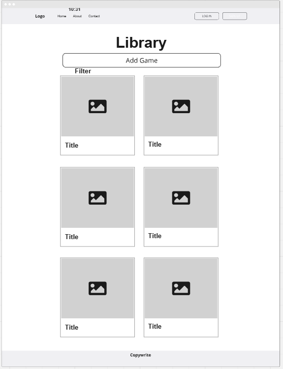
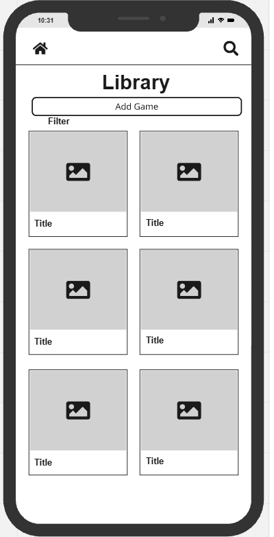

# Tabletop Night Tools

## Overview
A single site with tools to enable to easier hosting of board gaming nights or similar tabletop experiences. Currently, at time of writing, only contains the first app (The MVP, a board game library that can filter games by maximum player count for ease of hosting a night), but with room for significant expansion. 

Since the terms are used throughout, BGG refers to "Board Game Geek", and any references to the API refer to [The board game geek XML API2](https://boardgamegeek.com/wiki/page/BGG_XML_API2). 

## UX Design Process
- User Stories and Project Board
  - [Tabletop Night Tools Project Board](https://github.com/users/Philgck/projects/11)
- **Wireframes:**
    - 
    - 
    - The primary app created being a board game library, the intent was to display as much information as possible to the user without overwhelming the screen. Cards were chosen instead of a list so the images could be used as a focal point, displaying the art of different board games, and as links to the description of each game. Originally the cards also contained the descriptions of the board games as pulled from BGG, although this was changed early on in the project in order to make the design more cohesive and less text-heavy. 
    - The support page was also created using the same card structure to separate out content between the sections (Support requests and a call to action with regards to supporting the page). 
- **Design Rationale:**
- The design of the primary app was to be as simple as possible to provide a clear list of games and give access to further information upon clicking on either the image or the title of a game. The colour scheme was chosen to be high contrast to make it easy to read and the font was chosen as it is easy to read if you are dyslexic. 
- The colour scheme was also, in part, decided due to the integration of the BGG API: As it needs to be credited in order to be used, and the logo is orange and purple, in order to make the styling coherent these colours were necessary.
  - To the best of my knowledge, after testing, screen readers should be able to navigate the site. The site was tested to work keyboard only. 
- **Reasoning For Any Final Changes:**
  - Towards the end of the project I decided that turning the content across the site to display using bootstrap styled cards was more cohesive. 
  - As primarily a textual site, containerising content within a clear outline is helpful for those with dyslexia. The font choice was also made with this in mind, as was the high-contrast colour scheme. 

## Key Features
- **BGG API, Autopopulating Form 1:** This took the most work due to the nature of the API. When a user presses add game, a modal appears allowing manual entry of game details. If they enter a search term and press search, the API will fetch associated games (And only base games, no expansions or add ons as of time of writing.) and populate a dropdown list of choices. Upon selection, this auto fills the relevent fields (Title, Description, Minimum Player Count and Maximum Player Count). The other field (Review) is left blank and is intended for user reviews of games, currently for personal notes, but with space for future expansion
- **Maximum Player Count Feature:** The board games are currently displayed in a paginated list. The maximum player count feature allows users to put the upper bound on how many people might be attending an evening, and only displays games that can be played with this player count.
- **Inclusivity Notes:** 
  - The font choice was made after consulting with a dyslexic friend about readability, and is deliberately similar to Comic Sans as this is a very readable font. 
  - The buttons used throughout are consistently styled to give a visual cue. The primary buttons to advance are all styled to be similar to the overall colour scheme of the website, and the update and delete buttons were left with basic bootstrap styling as yellow and red are both colours associated with danger and caution.

## Deployment
- **Platform:** Heroku
- **High-Level Deployment Steps:** 
  1. Clone the repository from Github
  2. Set up the heroku environment with a postgreSQL database
  3. Configure the relevant environment variables for the sensitive data, such as secret keys and the database
  4. Deploy using github integration on Heroku
- **Verification and Validation:**
  - Create a test user and add several games to the library, making sure that the query is specific (The API currently filters out all expansions and tries to produce limited results. For example, Star Wars: Rebellion would bring up the game of the same name, whilst Rebellion would not return Star Wars: Rebellion). Once 7 or more test games have been added, log out and log back in. Assuming the games are still viewable, the deployment has gone successfully.
  - 7 or more games are recommended in the test to make sure the pagination of the library app is functional. 
- **Security Measures:**
  - Use of environment variables for sensitive data.
  - Ensured DEBUG mode is disabled in production.

## AI Implementation and Orchestration

### Use Cases and Reflections:

  - **Code Creation:** 
    - Both copilot and ChatGPT were used throughout the product with testing and implementing code. On a personal level, I have preferred using ChatGPT as it is easier to get it to query a singular piece of code, rather than the code in context. ChatGPT helped walk me through the debugging of the bgg_api.py file and its output and was essential in implementing the filters that prevented erroneous entries.
    - Whilst I did not save and record the prompts in question, after the initial issues with the API implementation I used ChatGPT to try and build a scraper using beautifulsoup. This turned out to be a dead end as the way the pages are populated involved javascript and I did not want to have to implement further libraries, and returned to tweaking the partially functional API in order to bring it to the standard required.
  - **Debugging:** 
    - Whilst building the API I limited the amount of results it could pull down to 20, in order to make it load significantly faster as there were extreme delays. Once the filters were in place, Copilot itself flagged the limit on results as no longer necessary. However I found copilot kept reintroducing a bug in the template language: For some reason it would add extra space in the second argument of player count (Maximum player count), breaking it every single time that it recommended changing code. 
  - **Performance and UX Optimization:** 
    - Changes to the API recommended by AI tools significantly improved performance of the API. However, any changes made to UX were discarded and replaced with human intervention. I would rather make sure that UX was designed for humans, instead of ammended to fit the output of an AI.
  - **Automated Unit Testing:**
    - After automated testing it was found that there were no issues with the models. 

- **Overall Impact:**
  - AI tools definitely streamlined tasks and were necessary for the development of parts of the project. I have learned more about how to prompt the revelant tools from this project alone than any of the others. Realising what a solution might be, and working with an AI to implement it, was an amazing learning experience and significantly less frustrating that attempting to work things out completely by myself.
  - Particularly with the API, ChatGPT was used in debugging output. I used it as a walkthrough guide where to add console logs to triple check where the points of failure might be.
  - Challenges included contextual adjustments to AI-generated outputs, which were resolved effectively, enhancing inclusivity.

## Testing Summary
- **Manual Testing:**
  - **Devices and Browsers Tested:** Samsung S8 Mobile Phone was used in order to test the website on phone in comparison to on desktop. It was found that the text-fields within multiple inputs do not resize automatically, and at time of writing the media query added to address this does not appear to have worked as intended.
  - **Features Tested:** Multiple accounts were created in order to test crud with regards to the library app. The support form was also manually tested. Everything worked as intended.
  - **Results:** All testing showed the site functioned well and that it meets minimum criteria. 
- **Automated Testing:**
  - Django Testcase was used in order to test the both the support and the libary app. 
  - Features Covered: Creating new game objects within the library app, sending messages requesting support.
  - Adjustments Made: Both models passed automated testing. 
- **WCAG testing**
  - https://validator.w3.org/ was used to validate the HTML across the files. No mistakes or errors were located.
  - https://www.accessibilitychecker.org/ was used to check that the site meets accessible criteria. A score of 95 was achieved prior to manual testing, which showed that the site functions when navigated purely by keyboard.
  - Lighthouse Score: 92 on Performance, 95 on accessiblity, 100 on best practices. SEO could be better optimised. 
  - Once the library has more games added to it, loading gets slower due to the images. The images are stored by BGG, and this limits some of the optimisation that could take place. 

## Future Enhancements
- The intent of the project was to create multiple tools to enhance the ability to host board game evenings. Currently there is just one, and a single filter by maximum player count. Other features might include storing tags for specific games so a host can filter by "Euro Game" or similar.
- A could have feature I wanted to implement was a friends list that would enable a user to share their library with others. Board game evenings are a fundamentally social experience, and being able to know what is in your own library and your friends libraries would be extremely helpful.
- The name itself belies the aim: It is supposed to be several tools. I want to add features that help with the hosting of Role Playing Games as well. 
- With regards to accessibility, directly in the tabletop space linking to specific sites dedicated to accessbility and potentially integrating some of their recommendations would be useful.
- The primary focus was making sure that I would achieve CRUD and hit my MVP. As a result, I did not explore AllAuth as much as I should. In future I would like to ammend this, create a functional accounts section and enable a user to manage their account properly. As it stands, a user can create a profile and log in to view specific content, and that is it. 
- Crispyforms were not used with the project. Considering the nature of some of the content this would be helpful to make certain areas of the site more visually appealing. 